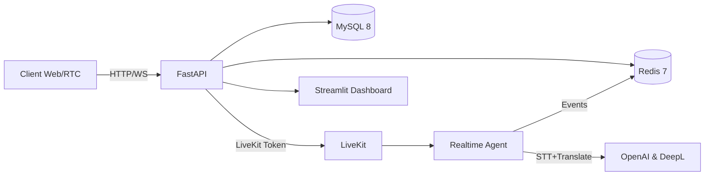

# URITOMO Backend

     

## Overview
- FastAPI + LiveKit backend for real-time JP↔KR meetings: auth, rooms, chat, STT translation, glossary, and ops dashboard in one place.

## Features
- JWT auth, room/member management, friends & DM
- LiveKit token issuance + Realtime Agent (STT → translate → Redis broadcast)
- WebSocket chat/STT events, REST translation & mock summarization
- Streamlit dashboard for quick table insights
- Worker token/service-key guardrails to protect ops workers

## System Architecture

## Tech Stack
| Area | Tools |
| --- | --- |
| Backend | FastAPI, Uvicorn, Pydantic v2, SQLAlchemy 2, Alembic |
| Data | MySQL 8, Redis 7 |
| Realtime/AI | LiveKit API/RTC, OpenAI SDK, DeepL |
| Infra | Docker & docker-compose, Makefile |
| Observability | structlog, python-json-logger |
| DevEx | Poetry, Ruff, Black, Mypy, Pytest |

## Implementation & Run Guide

### Setup / Deployment
- Prereqs: Docker, Docker Compose, Make. Prepare `.env`, then:
```bash
cp .env.example .env
make build && make up         # api + mysql + redis + dashboard
make migrate                  # Alembic upgrade head
./run.sh                      # build -> up -> migrate -> recreate LiveKit worker
# stop/clean: make down / make clean
```

- Compose profile: add `--profile with-worker` to include the worker container when available.
