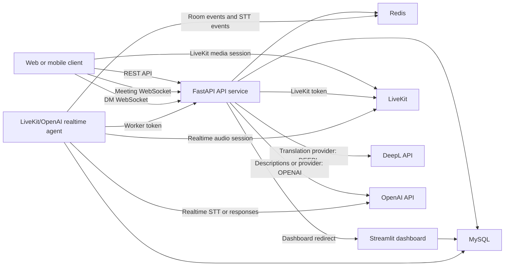

# URITOMO Backend

Backend API server for URITOMO, a real-time multilingual meeting and chat service. The server provides JWT authentication, room and friend management, WebSocket messaging, STT translation, summary mock APIs, LiveKit token issuance, and a LiveKit/OpenAI realtime agent.

## Quick Start

Copy the example environment file and set the required secrets.

```bash
cp .env.example .env
```

At minimum, set:

- `JWT_SECRET_KEY`: required, at least 32 characters
- `DEEPL_API_KEY` or `OPENAI_API_KEY`: optional, needed for non-mock translation or term descriptions
- `LIVEKIT_URL`, `LIVEKIT_API_KEY`, `LIVEKIT_API_SECRET`: optional, needed for LiveKit token issuance
- `WORKER_SERVICE_KEY`: optional, needed for worker token issuance

Start the Docker services and run migrations.

```bash
make build
make up
make migrate
```

API docs are available at:

```text
http://localhost:8000/docs
```

The repository also includes `run.sh`, which can run the Docker setup flow with build and migrations.

```bash
./run.sh
```

## Features

- JWT-based signup, login, and protected user APIs
- User profile, friend request, and friend management APIs
- Room creation, room detail, invitation, and room chat APIs
- WebSocket meeting and DM messaging
- STT translation through DeepL or mock translation
- Term description generation through OpenAI
- Mock summary, document, member, and translation-log APIs
- LiveKit token issuance and room event handling
- LiveKit/OpenAI realtime worker script
- Redis-backed STT event broadcasting
- Streamlit data dashboard

## Tech Stack

- Python 3.11 and Poetry
- FastAPI and Uvicorn
- MySQL 8, SQLAlchemy, and Alembic
- Redis
- LiveKit
- OpenAI and DeepL, both optional
- Streamlit
- Docker Compose

## Docker Compose Services

- `mysql`: MySQL 8 database
- `redis`: Redis instance used by the API and STT event listener
- `api`: FastAPI application on port `8000`
- `dashboard`: Streamlit dashboard on port `8501`
- `livekit_realtime_agent`: LiveKit/OpenAI realtime worker script
- `worker`: optional profile service declared as `with-worker`

Note: the `worker` service currently runs `python -m app.workers.worker`, but this repository does not contain that module. Do not use the `with-worker` profile until the command is updated or the module is added.

## Architecture


```mermaid
flowchart LR
    client["Web or mobile client"]
    api["FastAPI API service"]
    mysql["MySQL"]
    redis["Redis"]
    dashboard["Streamlit dashboard"]
    livekit["LiveKit"]
    realtime["LiveKit/OpenAI realtime agent"]
    deepl["DeepL API"]
    openai["OpenAI API"]

    client -->|"REST API"| api
    client -->|"Meeting WebSocket"| api
    client -->|"DM WebSocket"| api
    client -->|"LiveKit media session"| livekit

    api --> mysql
    api --> redis
    api -->|"Translation provider: DEEPL"| deepl
    api -->|"Descriptions or provider: OPENAI"| openai
    api -->|"LiveKit token"| livekit
    api -->|"Dashboard redirect"| dashboard

    dashboard --> mysql

    realtime -->|"Worker token"| api
    realtime -->|"Room events and STT events"| redis
    realtime -->|"Realtime audio session"| livekit
    realtime -->|"Realtime STT or responses"| openai
    realtime --> mysql
```

## Environment Variables

Runtime application settings are defined in `app/core/config.py`.

Important variables:

- `JWT_SECRET_KEY`: required, at least 32 characters
- `DATABASE_URL`: database connection URL. Docker Compose sets this for the `api` service from `MYSQL_USER`, `MYSQL_PASSWORD`, and `MYSQL_DATABASE`
- `REDIS_URL`: Redis connection URL. Docker Compose sets this for the `api` service
- `API_PREFIX`: optional API prefix, empty by default
- `TRANSLATION_PROVIDER`: `MOCK`, `DEEPL`, or `OPENAI`
- `DEEPL_API_KEY`: required when using DeepL translation
- `OPENAI_API_KEY`: required for OpenAI translation, descriptions, or realtime agent calls
- `OPENAI_MODEL`: OpenAI model name used by the app service
- `LIVEKIT_URL`, `LIVEKIT_API_KEY`, `LIVEKIT_API_SECRET`: required for LiveKit token issuance
- `WORKER_SERVICE_KEY`: required by `POST /worker/token`
- `CORS_ORIGINS`: optional CORS origin list

The `.env.example` file also contains variables used by Docker Compose and `workers/realtime_agent.py`, such as `LIVEKIT_BACKEND_URL`, `LIVEKIT_ROOM_ID`, `OPENAI_REALTIME_MODEL`, and realtime STT tuning values.

## Running With Docker

Start the default services:

```bash
make up
```

View logs:

```bash
make logs
make logs-api
```

Stop services:

```bash
make down
```

Run database migrations:

```bash
make migrate
```

Create a migration:

```bash
make migrate-create name=add_new_table
```

## Local Development

Install dependencies:

```bash
make install
```

Start only the local infrastructure services:

```bash
docker-compose up -d mysql redis
```

Run the API locally:

```bash
make run-local
```

When running locally outside Docker, set `DATABASE_URL`, `REDIS_URL`, and `JWT_SECRET_KEY` in `.env`.

## API and WebSocket Routes

The docs UI is available at `/docs`, and ReDoc is available at `/redoc`. API routes are prefixed by `API_PREFIX` when that setting is configured.

Main REST endpoints:

- `POST /signup`
- `POST /general_login`
- `GET /user/main`
- `GET /user/profile`
- `PATCH /user/profile`
- `POST /user/friend/request`
- `GET /user/friend/requests`
- `GET /user/friend/requests/received`
- `POST /user/friend/request/{request_id}/accept`
- `POST /user/friend/request/{request_id}/reject`
- `POST /user/friend/add`
- `POST /room/create`
- `GET /rooms/{room_id}`
- `POST /rooms/{room_id}/members`
- `POST /rooms/invite/{invite_id}/accept`
- `POST /rooms/invite/{invite_id}/reject`
- `GET /rooms/{room_id}/messages`
- `POST /rooms/{room_id}/messages`
- `POST /dm/start`
- `GET /dm/{thread_id}/messages`
- `POST /dm/{thread_id}/messages`
- `POST /translation/stt`
- `GET /translation/description/{room_id}`
- `POST /summary/{room_id}`
- `POST /summarization/{room_id}`
- `POST /meeting_member/{room_id}`
- `POST /translation_log/{room_id}`
- `POST /meeting/livekit/token`
- `GET /meeting/{session_id}/messages`
- `POST /worker/token`

WebSocket endpoints:

- `WS /meeting/{room_id}?token=<JWT>`
- `WS /dm/ws/{thread_id}?token=<JWT>`

Debug endpoints are mounted under `/debug` and are intended for local development.

## Realtime Agent

`workers/realtime_agent.py` runs the LiveKit/OpenAI realtime worker. It can fetch worker authentication from `POST /worker/token` when `WORKER_SERVICE_KEY` is configured, subscribe to LiveKit room events through Redis, and publish STT events back to the API.

Relevant environment variables are documented in `.env.example`, including:

- `LIVEKIT_BACKEND_URL`
- `LIVEKIT_ROOM_ID`
- `LIVEKIT_SERVICE_AUTH`
- `WORKER_SERVICE_KEY`
- `OPENAI_API_KEY`
- `OPENAI_REALTIME_MODEL`
- `OPENAI_REALTIME_TRANSCRIBE_MODEL`
- `LIVEKIT_ROOM_EVENTS_CHANNEL`

## Dashboard

The Streamlit dashboard is served on port `8501`.

```text
http://localhost:8501/dashboard
```

The API redirects `/dashboard` to the Streamlit dashboard URL.

## Quality

Run linters inside the Docker API container:

```bash
make lint
```

Format code inside the Docker API container:

```bash
make format
```

Run tests with pytest:

```bash
pytest
```

Note: this repository currently does not include a `tests/` directory.

## Project Structure

```text
URITOMO-Backend/
├── app/
│   ├── api/             # REST API routers
│   ├── core/            # configuration, security, logging, tokens
│   ├── dashboard/       # Streamlit dashboard
│   ├── debug/           # local debug APIs
│   ├── infra/           # database and Redis helpers
│   ├── meeting/         # meeting WebSocket, history, LiveKit APIs
│   ├── models/          # SQLAlchemy models
│   ├── summarization/   # package placeholder
│   ├── translation/     # translation and term-description services
│   ├── user/            # package placeholder
│   ├── worker/          # worker token API
│   └── main.py          # FastAPI entry point
├── migrations/          # Alembic migrations
├── workers/             # LiveKit realtime agent
├── docker-compose.yml
├── Dockerfile
├── Makefile
└── run.sh
```

## Production Notes

- Set `ENV=production` and `DEBUG=false`
- Use a strong `JWT_SECRET_KEY` and manage external API keys securely
- Configure production-grade MySQL and Redis endpoints
- Remove Uvicorn `--reload` from the API command for production deployments

## License

See `LICENSE`.
